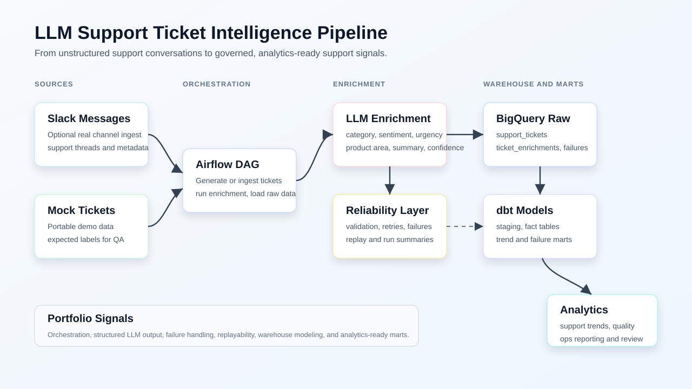

# LLM-Driven Support Ticket Intelligence Pipeline

This project is a portfolio-ready data pipeline that ingests support tickets, enriches unstructured messages into structured support signals, and models analytics-ready outputs for support trend analysis.

## Stack

- Airflow
- Python
- BigQuery
- dbt
- LLM API
- Docker

## MVP Scope

- generate mock Slack-style support tickets
- optionally ingest real support messages from Slack channels
- enrich ticket text with issue category, sentiment, urgency, product area, summary, and confidence
- persist raw and enriched records for warehouse loading
- capture failed enrichments for auditability and replay
- model analytics-ready support marts in dbt
- orchestrate the workflow in Airflow

## Architecture



Detailed architecture notes are available in [`docs/architecture.md`](docs/architecture.md).

## Project Layout

- `airflow/dags/`: orchestration DAG
- `data/raw/`: generated raw support tickets
- `data/processed/`: enrichment outputs, failure outputs, and run summaries
- `dbt/support_intelligence/`: staging and mart models
- `src/data/`: mock ticket generation
- `src/enrichment/`: LLM and fallback enrichment logic
- `src/orchestration/`: pipeline helper functions
- `scripts/`: local developer workflows

## Dependency Files

- `requirements.txt`: lightweight local demo dependencies
- `requirements-cloud.txt`: BigQuery, dbt, and OpenAI dependencies
- `requirements-airflow.txt`: native Airflow install dependencies
- `requirements-dev.txt`: local test dependencies

## Quickstart: Local Demo Without Credentials

Run the project locally without Slack, OpenAI, BigQuery, Airflow, or Docker credentials.

Set up Python dependencies:

```powershell
python -m venv .venv
.\.venv\Scripts\Activate.ps1
python -m pip install --upgrade pip
pip install -r requirements.txt
```

Run the local demo:

```powershell
.\scripts\run_local_demo.ps1
```

If PowerShell blocks local scripts, run the same script with a process-scoped bypass:

```powershell
powershell -ExecutionPolicy Bypass -File .\scripts\run_local_demo.ps1
```

Or run the Python module directly:

```powershell
python -m src.orchestration.local_demo
```

The local demo:

1. Generates mock Slack-style support tickets.
2. Runs deterministic fallback enrichment.
3. Writes generated outputs to `data/processed/`.
4. Prints a compact verification summary with row counts, success rate, and enrichment method.

Expected generated files:

- `data/raw/support_tickets.csv`
- `data/processed/ticket_enrichments.csv`
- `data/processed/ticket_enrichment_failures.csv`
- `data/processed/ticket_enrichment_run_summary.json`

See [`docs/local_demo.md`](docs/local_demo.md) for details.

## Full Cloud Workflow

1. Create a Python 3.11 virtual environment
2. Install the cloud dependency set:

```powershell
pip install -r requirements-cloud.txt
```

3. Copy `.env.example` to `.env` and fill in your BigQuery and OpenAI settings
4. Generate or ingest tickets:

```powershell
python -m src.data.generate_sample_tickets
```

5. Run enrichment locally:

```powershell
python -c "from src.orchestration.pipeline import enrich_support_tickets; enrich_support_tickets()"
```

6. Configure a dbt profile and run:

```powershell
dbt build --project-dir dbt/support_intelligence --profiles-dir dbt_profiles
```

## Slack Ingestion

The pipeline supports three source modes through `SUPPORT_INTEL_SOURCE_MODE`:

- `mock`: always generate synthetic support tickets
- `slack`: require Slack API ingestion
- `auto`: try Slack first, then fall back to mock data if credentials are missing or ingestion fails

To use Slack ingestion, set these environment variables:

- `SLACK_BOT_TOKEN`
- `SLACK_CHANNEL_IDS` as a comma-separated list like `C12345678,C87654321`
- optional `SLACK_LOOKBACK_DAYS`
- optional `SLACK_MAX_MESSAGES_PER_CHANNEL`

Then run the normal pipeline entry point:

```powershell
python -c "from src.orchestration.pipeline import generate_source_data; generate_source_data()"
```

## Reliability Features

- deterministic fallback enrichment when no API key is available
- validation for required keys, accepted values, non-empty summary, and confidence range
- automatic retry handling for LLM API enrichment attempts
- failed-record capture in `data/processed/ticket_enrichment_failures.csv`
- replay utility for failed rows with summary output in `data/processed/ticket_enrichment_replay_summary.json`
- run-level audit summary in `data/processed/ticket_enrichment_run_summary.json`
- model and prompt version tracking in enrichment outputs
- dbt failure-monitoring mart for failure counts by day, type, channel, model, and prompt version

## Screenshots And Demo Evidence

The architecture visual is committed at `docs/images/architecture.svg`. Credential-dependent screenshots should be captured after running the Airflow, BigQuery, and dbt workflow.

Use [`docs/screenshots.md`](docs/screenshots.md) for the exact screenshot checklist, filenames, and capture commands. Recommended gallery assets:

- `docs/images/airflow-dag-success.png`
- `docs/images/bigquery-raw-tables.png`
- `docs/images/dbt-build-success.png`
- `docs/images/dbt-lineage.png`
- `docs/images/support-ticket-trends-mart.png`

## Replay Failed Rows

Replay all currently failed rows:

```powershell
python -m src.orchestration.replay_failed_rows
```

Replay only the first 25 failed rows:

```powershell
python -m src.orchestration.replay_failed_rows --limit 25
```

## Tests

Install the dev dependency set and run the focused Python test suite:

```powershell
pip install -r requirements-dev.txt
pytest
```

The tests cover fallback enrichment, LLM payload validation, the credential-free local demo, and failed-row replay behavior.

## Airflow Install

Install Airflow separately with the official constraints file on Python 3.11:

```powershell
python -m pip install --upgrade pip
pip install -r requirements-airflow.txt --constraint "https://raw.githubusercontent.com/apache/airflow/constraints-2.10.0/constraints-3.11.txt"
```

The Docker Airflow image uses the official Airflow base image, so it installs `requirements-cloud.txt` only.

## Airflow With Docker

For a more realistic Airflow runtime on Windows, use Docker instead of the native CLI.

1. Copy `.env.airflow.example` to `.env.airflow`
2. Set your real GCP and optional Slack values
3. Point `HOST_GCP_KEY_DIR` at the folder containing your service-account JSON
4. Start Airflow:

```powershell
docker compose -f docker-compose.airflow.yml --env-file .env.airflow up --build
```

The Airflow UI will be available at [http://localhost:8080](http://localhost:8080).

Default login from the example file:

- username: `airflow`
- password: `airflow`

To stop the stack:

```powershell
docker compose -f docker-compose.airflow.yml down
```

## Next Steps

- add replay automation for failed rows
- add downstream marts for support SLA and incident trend reporting
- optionally switch from mock data to Slack API ingestion
