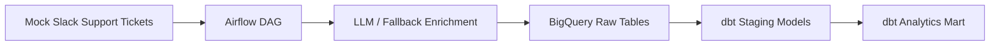

# Architecture Overview

The MVP flow is:

1. Generate or ingest support tickets
2. Enrich ticket text into structured fields
3. Load raw and enriched records into BigQuery
4. Build dbt models for analytics-ready reporting
