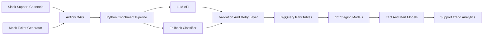

# Architecture Overview

This project turns unstructured support conversations into governed analytics outputs. It is intentionally shaped like a small production data pipeline: source selection, orchestration, enrichment, validation, warehousing, dbt modeling, and reporting-ready marts.

## High-Level Flow

```mermaid
flowchart LR
    A["Slack Support Channels"] --> C["Airflow DAG"]
    B["Mock Ticket Generator"] --> C
    C --> D["Python Enrichment Pipeline"]
    D --> E["LLM API"]
    D --> F["Fallback Classifier"]
    E --> G["Validation And Retry Layer"]
    F --> G
    G --> H["BigQuery Raw Tables"]
    H --> I["dbt Staging Models"]
    I --> J["Fact And Mart Models"]
    J --> K["Support Trend Analytics"]
```

## Pipeline Responsibilities

1. Generate or ingest support tickets from mock data or Slack.
2. Enrich each ticket with issue category, sentiment, urgency, product area, summary, and confidence.
3. Validate structured output and capture failed enrichment rows for auditability.
4. Persist raw tickets, enrichment outputs, failures, and run summaries.
5. Load raw and enriched data into BigQuery.
6. Use dbt to build staging, fact, trend, and failure-monitoring marts.

## Key Data Assets

| Layer | Assets | Purpose |
| --- | --- | --- |
| Source | `data/raw/support_tickets.csv` | Portable ticket input for local development and demo runs |
| Processed | `data/processed/ticket_enrichments.csv` | Structured enrichment output for warehouse loading |
| Reliability | `data/processed/ticket_enrichment_failures.csv` and run summary JSON files | Failure capture, auditability, and replay workflow |
| Warehouse | BigQuery raw tables | Durable landing area for source and enrichment data |
| dbt | staging, fact, trend, and failure marts | Analytics-ready support operations reporting |

## Reliability Design

- LLM output is validated for required fields, accepted values, summary presence, and confidence range.
- If an API key is unavailable, the pipeline uses deterministic fallback enrichment so local demos still run.
- Failed enrichment rows are persisted separately so they can be replayed after prompt, model, or data fixes.
- Model name and prompt version are carried into the output, which makes later quality reviews easier.
